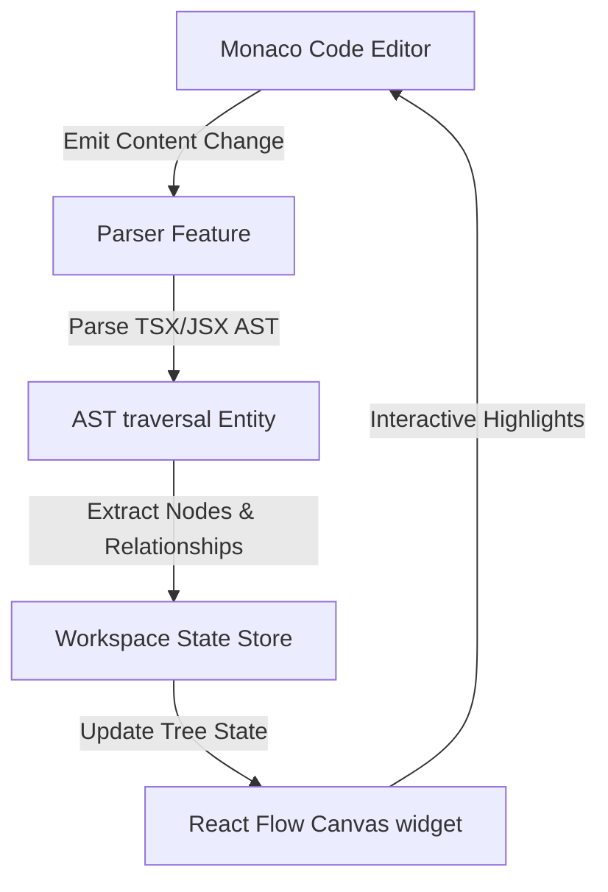

# <p align="center"></p>

# <p align="center">SynapseAST</p>

<p align="center">
  <strong>See Your Code Think</strong> — A real-time, interactive client-side Abstract Syntax Tree (AST) visualizer and parser explorer for JavaScript and TypeScript.
</p>

<p align="center">
  
  
  
  
</p>

---

## 🌟 What Problem It Solves

Abstract Syntax Trees (ASTs) are the foundational backbone of compiler design, static analyzers (like ESLint), and bundlers (like Babel, Vite, and Rollup). However:

- **High Learning Curve:** Understanding compiler theory and syntax trees often feels abstract and detached from code writing.
- **Invisible AST Nodes:** Memorizing node specifications (like `VariableDeclaration`, `Identifier`, or `BinaryExpression`) without seeing how they map to actual syntax lines is difficult.
- **Lack of Synchronization:** Standard compiler visualizers do not provide a real-time, bidirectional relationship between the syntax editor and the interactive graph nodes.

**SynapseAST** solves this by providing a premium, zero-latency parsing canvas that instantly builds a visual, interactive graph of your code's syntactic structure, updating as you type.

---

## 🎨 Key Features

- **Bidirectional Node Synchronization:** Instantly map code tokens to graph nodes. Hovering in Monaco highlights the node, and selecting a node reveals its precise range boundaries in the editor.
- **Branch Collapse & Expansion:** Effortlessly traverse large code blocks by collapsing nested scopes (like Class blocks or function closures) to focus on target nodes.
- **Dynamic Syntax Filtering:** Filter out low-level syntax classes (e.g., `Identifier`, `Literal`) to eliminate clutter and inspect structural flow.
- **High-Resolution PNG Export:** Download visual layout trees as high-density images with one-click full node expansion, perfect for documentation and architectural reviews.
- **Client-Side Parsing:** Zero server latency. Fully compiled and processed on the client side using high-precision Babel parsing rules.
- **Responsive Layout Handles:** Resizable code panes designed to adapt dynamically on mobile viewports and desktop resolutions.
- **Premium Themes:** Sleek ambient neon glows, custom legend lists, and responsive preloader animations that align with developer dark modes.

---

## 🚀 How It Solves It

1. **Real-time Parsing:** Leverages lightning-fast, client-side parsers to transform JavaScript and TypeScript into AST representation instantly.
2. **Interactive Node Highlighting:** Hovering over a code segment in the Monaco editor highlights the corresponding node in the graph, and clicking a graph node highlights the related code segment in the editor.
3. **FSD Architecture Layout:** Built cleanly using **Feature-Sliced Design (FSD)** architecture, decoupling state management, page modules, widgets, and parsing features.
4. **Rich Visual Aesthetics:** Featuring neon ambient glows, smooth micro-animations, color-coded node categories, and fully-responsive resize handles.

---

## 📐 Architecture Overview

<details>
<summary><b>Click to expand FSD architectural overview</b></summary>

### Feature-Sliced Design (FSD) Structure

SynapseAST is structured strictly around FSD principles to ensure high maintainability, code readability, and clean dependency directions:

```
src/
├── app/                  # Application initialization (routing, styles, global state)
├── pages/                # Page compositions (Landing, Editor, Examples, Docs)
├── widgets/              # Interactive components (ASTGraph, CodeEditor, Header, Footer)
├── features/             # Business capabilities (ast-parse engine)
├── entities/             # Business concepts & states (ast metadata, workspace state)
└── shared/               # Reusable utility scripts and visual design assets
```

### Data & Compilation Flow Diagram



</details>

---

## 📂 Project Directory Structure

<details>
<summary><b>Click to expand complete project structure</b></summary>

```
SynapseAST/
├── .github/                  # Github Actions workflows (ci, e2e, deploy)
├── .husky/                   # Pre-commit & pre-push check hooks
├── public/
│   └── assets/               # Deployed favicons, logos, brand vector files
├── src/
│   ├── app/                  # Main App wrapper & stylesheets
│   ├── entities/             # AST traversal helpers and shared workspace state
│   ├── features/             # AST parsing configurations
│   ├── pages/                # App pages (Landing, Editor, Examples, Docs)
│   ├── shared/               # Preloader, UI buttons, utility helper hooks
│   └── widgets/              # Header, Footer, Monaco Editor, ReactFlow AST Canvas
├── tests/
│   ├── e2e/                  # Playwright end-to-end browser specifications
│   └── setup.ts              # Unit test configuration setup
├── package.json              # App dependencies & run scripts
├── playwright.config.ts      # Playwright configurations
├── release.md                # Release specifications and changelog roadmap
├── tailwind.config.js        # Style tokens
├── vite.config.ts            # Vite compile environment variables
└── vitest.config.ts          # Vitest suite rules
```

</details>

---

## ⚙️ How It Works

1. **Input Stage:** The user enters JavaScript or TypeScript code into the high-performance Monaco Editor.
2. **Analysis Stage:** The system parses the AST, maps coordinates, and populates node scopes (Variable declarations, Class declarations, Imports, etc.).
3. **Graph Rendering Stage:** Nodes are mapped to a custom `ReactFlow` graph canvas. Color-coded legend badges help distinguish between syntax types (Declarations, Expressions, Statements, Literals).
4. **Synchronization Stage:** Highlights are synchronised bi-directionally between the AST graph nodes and the editor code markers.

---

## 💻 Runtime Requirements

To run this project locally, ensure you have the following installed:

- **Node.js:** `v20.x` or later (recommended)
- **npm:** `v10.x` or later (packaged with Node.js)
- **Browser:** Modern browser (Chrome, Firefox, Edge, or Safari) supporting CSS Grid, Flexbox, HTML5 Canvas, and WebGL.

---

## 🛠️ Installation & Local Development

1. **Clone the Repository:**

   ```bash
   git clone https://github.com/logusivam/SynapseAST.git
   cd SynapseAST
   ```

2. **Install Dependencies:**

   ```bash
   npm install --legacy-peer-deps
   ```

3. **Start Development Server:**

   ```bash
   npm run dev
   ```

   Open `http://localhost:5173` in your browser to inspect the application.

4. **Build Production Assets:**
   ```bash
   npm run build
   ```

---

## 🧪 Testing

SynapseAST runs a dual-layer verification process consisting of unit test configurations and full end-to-end (E2E) UI specs.

<details>
<summary><b>Click to expand testing execution guides</b></summary>

### 1. Unit Tests (Vitest)

Unit tests verify utility libraries, AST parsing nodes, and traversal mechanisms:

```bash
npm run test
```

### 2. End-to-End Tests (Playwright)

End-to-End browser specs verify page navigation, responsive workspace resizes, and interactive editor highlighting:

```bash
# Run tests across multiple browsers (Chromium, Firefox, WebKit)
npm run test:e2e
```

</details>

---

## 📝 Release Notes

<details>
<summary><b>Click to expand release version notes</b></summary>

### `v1.1.0` (July 2026)

- **High-Quality Export:** Click-to-export visual trees as high-density PNG files with automatically expanded branches and high-contrast connection labels.
- **Dependency Added:** Integrated the `html-to-image` npm library.

### `v1.0.0` (Initial Release)

- **AST Visualizer Workspace:** Interactive visual tree layout combining Monaco Editor and ReactFlow Canvas.
- **Bidirectional Highlights:** Bidirectional cursor-graph synchronisation support.
- **Preloading Screen:** Global animated Preloader showing real-time parsing engine boot stages.
- **Refined Branding Assets:** SVG brand vectors (`nav-logo.svg`, `footer-logo.svg`) and multi-size favicon tags.
- **Testing & Tooling:** Integrated Vitest unit tests, Playwright E2E browser tests, ESLint config, and Husky pre-commit hooks.
- **Responsive Layout:** Responsive layout splitting for desktop and mobile viewports.

</details>

---

## 🔒 Legal Disclaimer

- **No Warranties:** SynapseAST is provided "as is" and "as available", without warranty of any kind, express or implied.
- **Usage Risk:** The developers are not liable for any code execution errors, memory allocation leaks inside local browser instances, or compilation mismatches resulting from external custom AST code entries.

---

## ⚖️ License

Distributed under the MIT License. See `LICENSE` for more information.

---

## 🤝 Credits

- **Lead Creator & Designer:** [Loganathan G P (LOGUSIVAM VISION)](https://github.com/logusivam)
- **Design Guidelines & Palette Support:** Inspired by `ui-ux-pro-max` systems.
- **Vercel Deployments:** Powered by Logusivam Vision.
